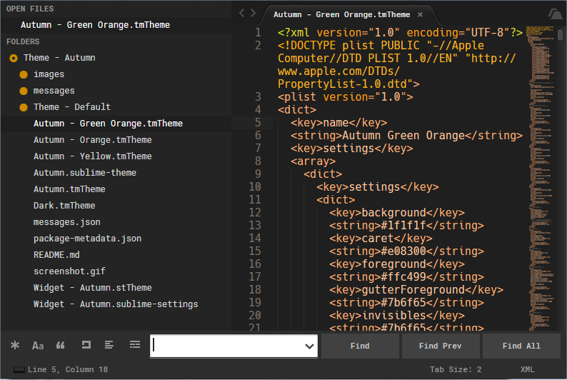

# Theme - Autumn

## About

  This is a theme and color scheme inspired by autumn colors. It was made with the help of [Flatland](https://github.com/thinkpixellab/flatland). It use the Default theme before Sublime Text build 3143.

## Screenshot

  


  

## Installation

  Like others packages there are several ways to install it.

  1. Via Package Control   

    Open "Package Control (Command-Shift-P) and through the option: **Package Control:Install Package** search for 'Theme - Autumn'. Hit enter to install it.
   

  2. Via GitHub

    Clone the repo directly into the Sublime packages directory. That folder appear through the Sublime Menu option: **Preferences > Browse Packages** 

    ```bash
    git clone https://github.com/DiegoAz/Theme-Autumn.git
    ```

  3. Via manual

    3.1. [Download theme files](https://github.com/DiegoAz/Theme-Autumn/archive/master.zip)

    3.2. Unzip the files. Copy the folder into the Sublime packages directory. Change the folder name to `Theme - Autumn`.


## Activating the Theme

  Include the following in the Sublime user settings file. That file appear through the Sublime Menu option: **Preferences > Settings - User"**

  ```javascript
  {
    "theme": "Autumn.sublime-theme",
    "color_scheme": "Packages/Theme - Autumn/Autumn.tmTheme"

    //options - Look at the png screenshot to see the next options activated

    "theme-autumn-flat-buttons": true,
    "theme-autumn-orange-folders": true,
    // "theme-autumn-gray-folders": true,
    "theme-autumn-roboto-font": true, // You need to install Roboto Mono and Roboto Mono Medium
  }
  ```
  Another options to activate the theme are:

  - Using the Preferences menu option and click: Theme... 
  - Press Ctrl/⌘ + ⇧ + P to open Command Palette, and search for UI:Select Theme

## File Icons

  If you want to add file icons you could install the package [A file Icon](https://packagecontrol.io/packages/A%20File%20Icon)

## Support

  - [Git Gutter](https://packagecontrol.io/packages/GitGutter)
  - [Oracle PL SQL](https://packagecontrol.io/packages/Oracle%20PL%20SQL)

    Install this package and Set Syntax (PL/SQL) Oracle to the pl/sql files.

## Note about Sublime Text 3 (Build 3143)

  Because this theme was referencing images in the Theme - Default that no longer exist I have included the classic Sublime Default theme inside this theme. See [this](https://forum.sublimetext.com/t/very-colorful-tabs/31244) post to get more information.

## License

  This package is licensed under a [Creative Commons Attribution-ShareAlike 4.0 International License](http://creativecommons.org/licenses/by-sa/4.0/)

## Donations

  Hi! If you want you can make a donation. 

  [](https://pledgie.com/campaigns/35244)

