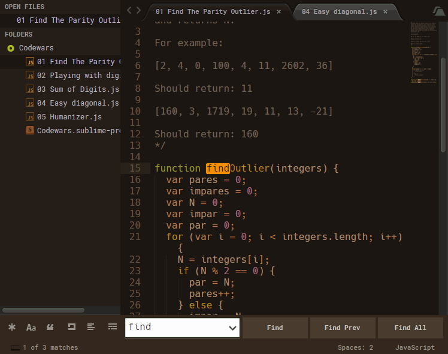

# Theme - Autumn

[](https://gitter.im/Theme-Autumn/Lobby)

[](https://www.paypal.me/DiegoAz)


## About

  This is a theme and color schemes inspired by autumn colors. It was made with the help of [Flatland](https://github.com/thinkpixellab/flatland). It use the Default theme before Sublime Text build 3143, thanks to its creators for allowing me to use it.

## Screenshot

  


## Installation

  Like others packages there are several ways to install it.

  1. Via Package Control   

    Open "Package Control (Command-Shift-P) and through the option: **Package Control:Install Package** search for 'Theme - Autumn'. Hit enter to install it.
   

  2. Via GitHub

    Clone the repo directly into the Sublime packages directory. That folder appear through the Sublime Menu option: **Preferences > Browse Packages** 

    ```bash
    git clone https://github.com/DiegoAz/Theme-Autumn.git
    ```

  3. Via manual

    3.1. [Download theme files](https://github.com/DiegoAz/Theme-Autumn/archive/master.zip)

    3.2. Unzip the files. Copy the folder into the Sublime packages directory. Change the folder name to `Theme - Autumn`.


## Activating the Theme & options

  Include the following in the Sublime user settings file. That file appear through the Sublime Menu option: **Preferences > Settings - User"**

  ```javascript
  {
    "theme": "Autumn.sublime-theme",
    // "theme": "Autumn - Tolopea.sublime-theme",
    "color_scheme": "Packages/Theme - Autumn/Autumn - Peach Orange.tmTheme"

    //options - See screenshot to see the different options 

    "theme_autumn_flat_buttons": true,
    "theme_autumn_orange_folders": true,
    // "theme_autumn_gray_folders": true,
    // "theme_autumn_rose_folders": true,
    "theme_autumn_roboto_font": true, // You need to install Roboto Font and Roboto Font Medium 
  }
  ```
  Another options to activate the theme are:

  - Using the Preferences menu option and click: Theme... 
  - Press Ctrl/⌘ + ⇧ + P to open Command Palette, and search for UI:Select Theme

## Color schemes

  You can activate one of sixteen (16) color schemes from 3 different background colors

  Some of them are:

  
  
   

  The name of them came from [Name that Color](http://chir.ag/projects/name-that-color/) or [Color Name & Hue](http://www.color-blindness.com/color-name-hue/). Thanks to its creators  


## Customizing color schemes

  To facilitate changes to the color schemes I have added the .styluscheme files used to generate the color schemes. To do this, make use of [PackageResourceViewer](https://packagecontrol.io/packages/PackageResourceViewer) to extract this package and [CSScheme](https://packagecontrol.io/packages/CSScheme) to generate the color schemes(.tmTheme files). Thanks to its creators

## File Icons

  If you want to add icons to the different files install [A File Icon](https://packagecontrol.io/packages/A%20File%20Icon)


## Support

  - [Git Gutter](https://packagecontrol.io/packages/GitGutter)

## Note about Sublime Text 3 (Build 3143+)

  Because this theme was referencing images in the Theme - Default that no longer exist I have included the classic Sublime Default theme inside this theme. See [this](https://forum.sublimetext.com/t/very-colorful-tabs/31244) post to get more information.

## Do you like the themes and color schemes?

  Would you like to buy me a coffee or a beer?

  [](https://www.paypal.me/DiegoAz)

  Thanks :)

## License

  This package is licensed under a [Creative Commons Attribution-ShareAlike 4.0 International License](http://creativecommons.org/licenses/by-sa/4.0/)